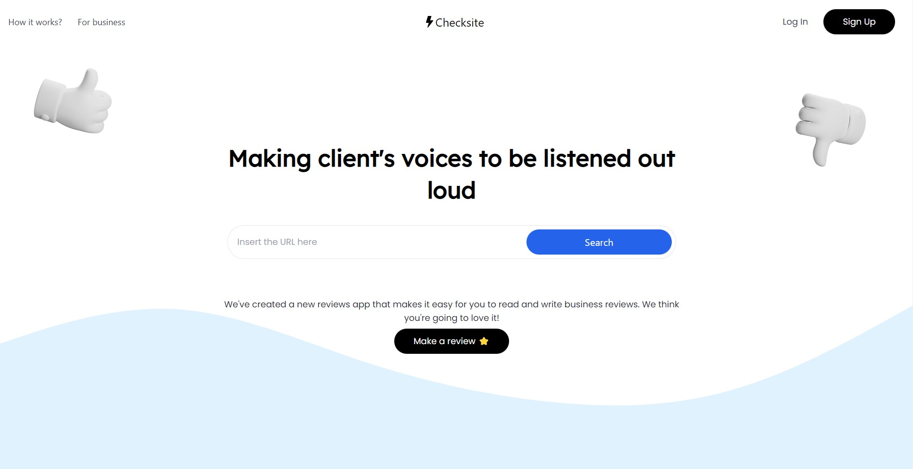

<h1 align="center"><a href="https://c8-45.vercel.app/">CHECKSITE</a></h1>

<p align="justify">
  Este proyecto consiste en un sitio web de reseñas de compañias, donde los usuarios pueden calificar y comentar acerca de sus experiencias con distintas compañias. Este producto buscar acercar a los consumidores con las empresas, así estas puedan obtener feedback transparente para poder mejorar los servicios que ofrecen. Y así los consumidores puedan utilizar sus servicios con tranquilidad, sabiendo que pueden confiar en ellas.
</p>


<div align="center"><a href="https://c8-45.vercel.app/"> 🌩️ Visita el sitio web 🌩️ </a></div>

<h3> 🖥️ Instalación</h3>
Para correr este proyecto de forma local debes:

1. Descargar este repositorio.
2. Abrir el proyecto con un editor de código.
3. Instalar las dependencias usando el comando _npm install_ en las dos carpetas principales (backend y frontend).
4. Crear un archivo _.env_ en ambas carpetas, y completar los siguientes datos:

_en el .env del FRONTEND_
```sh
VITE_SERVER_ENDPOINT=http://localhost:3000
```
_en el .env del BACKEND_
```sh
DB_NAME=
DB_HOST=localhost
DB_USER=root
DB_DRIVER=mysql
DB_PASSWORD=
DB_PORT=3306
PORT=3000
SECRETORPRIVATEKEY=
```
5. Crear una base de datos en MySQL con el mismo nombre puesto en el archivo _.env_ y conectarse a la misma.
6. Asegurarse que la base de datos haya iniciado, y ejecutar las migraciones y los seeders.
```sh
npm run db:reset
```
7. Iniciar el proyecto en ambas carpetas.
```sh
npm run dev
```
8. Abrir http://localhost:3000.

<h3> 🎨 Diseño UX - UI</h3>

- [Figma](https://www.figma.com/) [(Mockup)](https://www.figma.com/file/t4e9ldiztz1Ue6ideFkBTI/Reviews-App?node-id=0%3A1&t=Fr83rL2tTha6ptLC-1)


<h3> 🛠️ Tecnologías</h3>

<h4>Frontend</h4>

- [ReactJS](https://es.reactjs.org/)
- [TypeScript](https://www.typescriptlang.org/)
- [TailwindCSS](https://tailwindcss.com/)

<h4>Backend</h4>

- [MySQL](https://www.mysql.com/) 
- [Typescript](https://www.typescriptlang.org/)
- [Nodejs](https://nodejs.org/en/)
- [TypeOrm](https://typeorm.io/)

<h3> 🤝 Equipo</h3>

- [Pierre Campoverde](https://github.com/pierre-campoverde) - Frontend
- [Alvaro Canales](https://github.com/Alvaro1599) - Backend
- [Rony Puche](https://www.linkedin.com/in/rony-puche-a80275234/) - Frontend
- [Ramiro Morard](https://github.com/MorardRamiro) - Frontend
